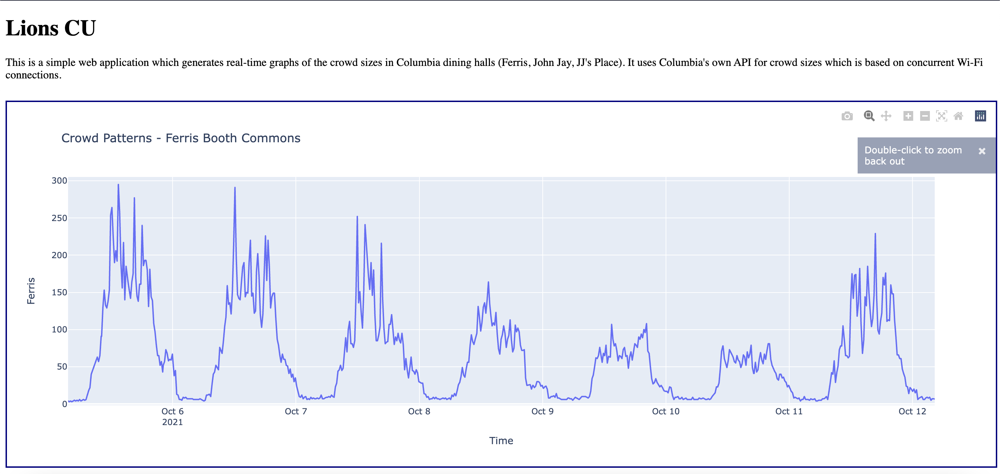

# Lions Columbia

## Description
A live [web-app](http://lionscu.live/) to monitor the capacity of Columbia dining halls and libraries in real time. Uses a Microsoft Azure backend and Plotly for creating interactive graphs.

Note (10/13/2021): Website is down due to monthly Heroku dynos being used up. Dyno scheduling would solve this problem.

## Example Graph

